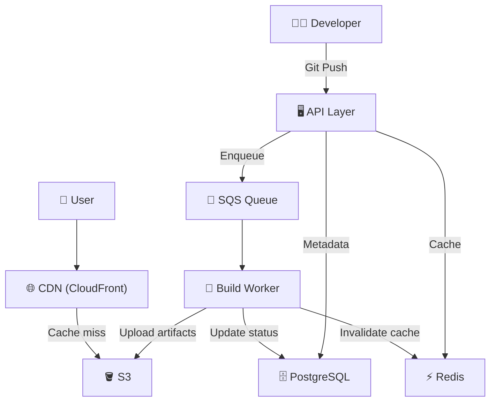

# Hostra: System Design of a Vercel-Like Deployment Platform

> Deploy frontend apps from Git push to global CDN in under 30 seconds.

---

## What is Hostra?

Hostra is a Vercel-like platform — you push code, it builds your frontend app and serves it globally through a CDN. Two flows drive everything: **Deployment** (Git push → build → publish) and **Serving** (user request → CDN → static assets).

---

## Problem Statement

- Accept Git webhooks, run builds, serve static output
- Handle **1M+ requests/day** with sub-100ms latency
- Support rollbacks, custom domains, concurrent builds
- 99.9% uptime on the serving layer

---

## Architecture



---

## Component Breakdown

| Component | Role | Why |
|---|---|---|
| **CDN** | Serves assets at the edge | Absorbs 95%+ of traffic; origin never sees most requests |
| **Load Balancer** | Routes traffic across API instances | Health checks + TLS termination |
| **API Layer** | Stateless control plane | Horizontally scalable; handles webhooks + dashboard |
| **Redis** | Caches hot metadata | Domain→deployment mapping, rate limit counters |
| **PostgreSQL** | Metadata only | Projects, deployments, statuses — never files |
| **SQS** | Decouples API from workers | Absorbs build spikes, handles retries automatically |
| **Workers** | Runs builds in isolation | Clone → install → build → upload → update status |
| **S3** | Immutable artifact storage | Each deployment gets a unique prefix; rollbacks are free |

---

## End-to-End Flows

**Deployment:**
```
Git push → Webhook → API enqueues job → Worker builds →
Uploads to S3 (/deployments/{id}/) → Updates DB + Redis → Live ✓
```

**Request:**
```
User → CloudFront (cache hit → done) → cache miss → S3 → response cached
```

The key insight: every deployment writes to a **new S3 prefix**. No cache invalidation needed — just update the Redis routing record.

---

## Scaling to 1M+ Requests

- **CDN handles 95%** — origin sees only cache misses
- **Stateless API** — add instances behind ALB with zero coordination
- **SQS buffers build spikes** — workers auto-scale based on queue depth
- **Redis** keeps hot reads off PostgreSQL
- **PgBouncer** pools DB connections when API instances multiply

---

## Advanced Improvements

- **Dead Letter Queue** — failed builds after 3 retries go to DLQ → alert on-call
- **Structured logging** — attach `deploymentId` + `traceId` to every log line
- **Rate limiting** — Redis sliding window; 10 deploys/min per user
- **Blue/green deploys** — Hostra deploys itself the same way it deploys your app

---

## Common Mistakes

| Mistake | Fix |
|---|---|
| Workers polling the DB for jobs | Use SQS |
| Storing files/blobs in PostgreSQL | Use S3 |
| No CDN in front of assets | Always put CloudFront in front |
| No retries on build failure | Don't delete SQS message on error — let it retry |
| Synchronous build response | Return `202 Accepted`, build async |

---

## Key Principles

1. **Stateless** — no instance holds state; anything can restart or scale freely
2. **Decoupled** — the queue between API and workers lets both evolve independently
3. **Immutable deployments** — new prefix per deploy; rollback = pointer swap

---

## Conclusion

The architecture isn't exotic — CDN, S3, stateless API, SQS, Redis, PostgreSQL. The value is in understanding *why* each piece exists. The CDN is load-bearing. The queue is what makes builds resilient. Immutable prefixes make rollbacks trivial. Get these decisions right early; retrofitting them later is painful.
